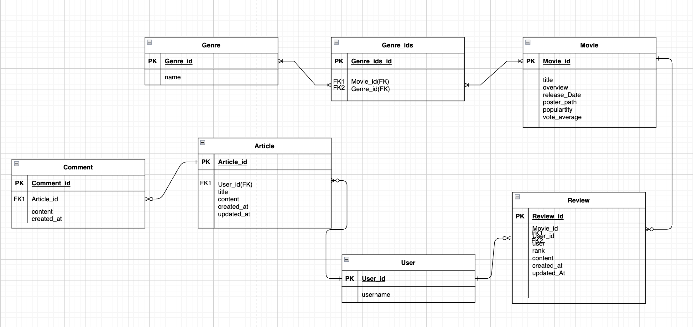

- 1. 팀원 정보 및 업무 분담 내역

    - 이금규(백엔드) : 
        1. 클라이언트(Client) 요청에 대한 응답, 데이터 저장 및 로직 처리
        2. model 생성
        3. serializer 구현
        4. views.py 로직 구현
        5. PPT 제작
        6. ERD 작성
        7. Dumpdata로 JSON파일 추출

    - 임준환(프론트엔드) : 
        1. 레이아웃, 디자인, 기능 구현 등을 담당, 웹 페이지를 구성하고 동적인 기능을 추가
        2. axios 비동기식 요청을 통한 데이터 통신
        3. CSS스타일을 통한 3D 효과와 화면 특수 효과 적용
        4. Component 구조와 화면 레이아웃 구성
        5. PPT 작성 및 발표
        6. Router를 통한 웹 페이지 이동 관리

- 2. 목표 서비스 구현 및 실제 구현 정도
    - 목표 서비스 : 
        1. 커뮤니티 기능(댓글, 좋아요, 팔로우 등)을 겸비한 사용자의 로그인 접속 시간에 따라 영화를 추천해주는 서비스 
    
    - 실제 구현 정도 :
        1. 회원가입
        2. 로그인 및 로그아웃
        3. 회원 정보 수정
        4. 영화 리스트 조회
        5. 영화 상세 페이지
        6. 영화 리뷰
        7. 게시판 작성
        8. 게시글 상세 조회
        9. 댓글 작성 및 삭제

- 3. 데이터베이스 모델링 (ERD)
    
    
- 4. 영화 추천 알고리즘에 대한 기술적 설명
    1. User의 로그인 기록을 Vuex의 store에 저장
    2. 6시간 단위로 24시간을 아침, 점심, 저녁, 새벽으로 구간을 나눔
    3. 사용자 로그인 시간에 따라 추천 서비스를 맞춤형으로 제공
    4. 각종 자료를 참고하여 장르를 아침 = 코미디, 점심 = 액션, 저녁 = 로맨스, 새벽 = 호러 방식으로 적극 추천

- 5. 서비스 대표 기능에 대한 설명
    - 사용자 로그인 시간에 따라 추천 서비스를 맞춤형으로 제공
    - 각종 자료를 참고하여 장르를 아침 = 코미디, 점심 = 액션, 저녁 = 로맨스, 새벽 = 호러 방식으로 적극 추천

- 6. 배포 서버 URL (배포했을 경우)
    - 배포하지 못했음
- 7. 기타(느낀 점, 후기 등)

# 이금규

먼저 팀 프로젝틀르 진행할 때 가장 먼저해야할 것은 코드를 짜는 것보다 기획에 정말 많은 시간과 노력을 들여야한다는 점을 깨달았다.
우리가 어떤 이유를 가지고 어떻게 무엇을 제공할 것인지에 대한 기본적인 흐름을 명확하게 인지해야겠다.
무엇보다 페어와의 소통이 정말 중요했다. 프로젝트 경험이 전무하여 급한 마음에 이것저것 시도했지만 페어와 소통을 통해 천천히 방향을 잡기 시작해서 좋았다.
기획에 있어서 컨벤션, 하루하루 어떤 업무를 할 것인지, 업무를 어떻게 분담할 것인지, 진행 상황 관리 등 다양한 경험을 하면서 개발자로서 역량을 키울 수 있었다.
기술적으로는 JWT 토큰 방식의 로그인, 게시글 작성 수정 삭제, 리뷰 작성 및 삭제, 영화 추천 알고리즘 등 배웠던 내용을 활용하면서 이해도가 많이 늘었다. 클라이언트와 서버 구조가 어떻게 상호작용하면서 이루어지는지 프로젝트를 경험하면서 몸소 깨달을 수 있었다. 특히, 데이터 관계에 대한 개념의 중요성을 깨닫는 프로젝트였다.

# 임준환

나도, 페어도 난생처음 해보는 프로젝트라 처음에는 어떤 방법으로 진행할지 해맸던 거 같다. 그래서 무작정 같이하다가 우리가 목표로 잡은 구현정도를 다 구현하지 못할 거 같아 백엔드와 프론트엔드를 나눠 코드구현을 하였다. 다행히 처음보다는 속도가 붙기 시작했고 어느정도 목표한 바를 이룰 수 있게 되었다. 이번 프로젝트를 하면서 페어와의 의사소통이 프로젝트를 진행함으로써 제일 중요하다는 것을 알게 되었고, 어떤 방향으로 진행할지, 어떤 방식으로 진행할지 처음에 잘 의논해야 나중가서 덜 고생한ㄷ는 것을 알게 되었다.